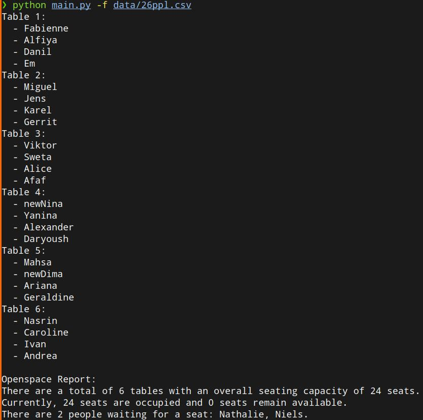

# Open Space Organizer

## Description


The Open Space Organizer optimizes seating arrangements in open space environments, promoting interaction and collaboration. This tool uses Python to randomize seating, addressing the challenge of office space management efficiently.

## Installation

1. Clone the repository:

```shell
git clone https://github.com/yourusername/challenge-openspace-classifier.git 

cd challenge-openspace-classifier
```


### Running the Application

To run the application with the basic setup, execute:

```
python main.py
```

This initiates the program with a default configuration of 6 tables, each having 4 seats, and randomly assigns 24 participants. The results are displayed in the console.


### Configuration Customization
You can easily modify the application settings by adjusting the .config.json file. The default configuration is as follows:


```
{
  "NumberOfTables": 6,
  "CapacityPerTable": 4,
  "ColleaguesFilePath": "./data/new_colleagues.csv"
}

```
To change the settings, edit the respective values in config.json. This allows for customization of the number of tables, capacity per table, and the path to the colleagues file.

The application also supports modifying settings directly via command line arguments. For instance, to change the file used for the colleagues list, you can execute the script with the -f parameter followed by the path to the new file:

```
python main.py -f path/to/your/colleagues/file.csv
```

This feature allows for dynamic adjustment of input parameters without altering the config.json file, providing flexibility for different runtime scenarios.

For detailed information about all available command line options, you can use the -h flag:

```
python main.py -h
```
This will display a help message outlining all the command line arguments you can use with the application, including their descriptions and usage.
This displays and can save the seating arrangement.

### Stay Updated
Make sure to follow updates for the application to stay informed about new features or changes to existing functionalities. This ensures you can leverage the full potential of the application as it evolves.
## Visuals



## Contributing

Contributions are welcome! For major changes, please open an issue first to discuss what you would like to change.
